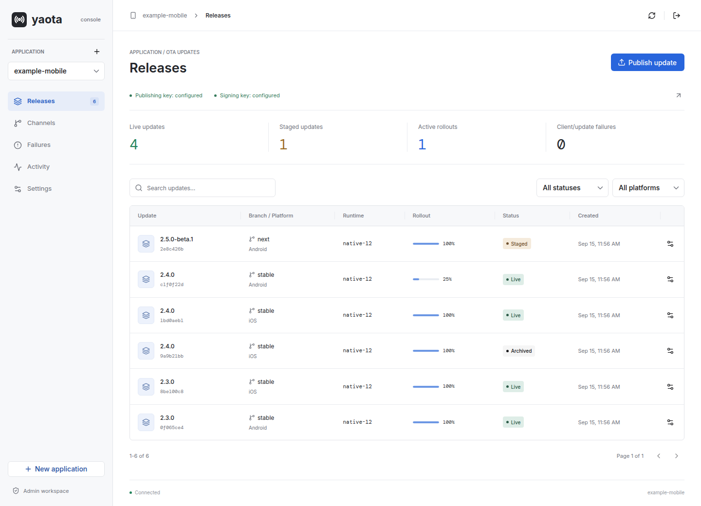

# yaota

Self-hosted Expo OTA updates on Cloudflare Workers, with signed releases, multi-app channels, binary diffs, and a HeroUI dashboard.

[Local demo](#try-it-locally) | [Configuration & protocol](docs/cohub-ota.md) | [Mobile CI integration](docs/mobile-ci-integration.md)



*The real dashboard with local sample data. Each deployment requires its own admin token.*

## What You Get

- **Multiple applications.** Create explicit app IDs, then manage each app's channels, branches, releases, and native runtimes independently.
- **Controlled releases.** Stage updates, promote to a branch, increase rollout percentages, or roll back to a previous or embedded update.
- **Signed distribution.** Immutable update identities, RSA signatures, asset integrity hashes, per-app signing keys, and native fingerprint checks.
- **Smaller transfers.** Content-addressed R2 storage deduplicates bundles and resources. The TypeScript publisher uploads only missing blobs and generates verified BSDIFF40 patches for SDK 57, with full-bundle fallback.
- **An operational dashboard.** English-first, responsive React 19 + HeroUI v3 views for Releases, Channels, Failures, Activity, and Settings.
- **CI-ready publishing.** A TypeScript publisher and reusable GitHub Action, plus compatibility with the existing multipart upload contract.

The Worker uses [Hono](https://hono.dev/docs/getting-started/cloudflare-workers-vite) and the official Cloudflare Workers Vite plugin. D1 holds application and release state; R2 holds content-addressed distribution artifacts.

## Try It Locally

Requires **Node.js 24+**. This starts a populated dashboard backed by disposable local workerd, D1, and R2 instances. No Cloudflare account or production credentials are needed.

```bash
git clone https://github.com/markbang/yaota.git
cd yaota
npm ci
npm run build
node scripts/smoke-ota.ts --serve
```

Open the `/admin` URL printed in the terminal and sign in with the test-only token `local-admin-only`. This mode generates a temporary signing key and runs protocol checks before serving the dashboard. Its data disappears when the process exits.

## Publish an Update

1. Create an application in `/admin`. There is no default app ID.
2. Configure a publishing credential and the signing private key matching the certificate trusted by the native app.
3. Use the Expo export and public config from the same build, with the runtime embedded in the installed binary.

Run from this repository, with `OTA_API_KEY` supplied through your environment or CI secret:

```bash
export OTA_SERVER="https://ota.example.com"

node scripts/publish.ts \
  --app-id your-app \
  --export-dir /path/to/expo-export \
  --config /path/to/expo-public-config.json \
  --platform android \
  --runtime "$NATIVE_RUNTIME" \
  --fingerprint "$SOURCE_FINGERPRINT" \
  --channel production \
  --staged
```

`NATIVE_RUNTIME` is the installed binary's runtime; `SOURCE_FINGERPRINT` describes the export's native dependencies. Resolve both from your build metadata, not a guessed app version. Use `--platform ios` for an iOS export.

The publisher uploads missing blobs and verifies patches against compatible historical bundles before activation. `--staged` keeps the update out of delivery until explicitly promoted. Dashboard and legacy multipart uploads are supported, but **do not automatically generate binary patches**.

See [Mobile CI integration](docs/mobile-ci-integration.md) for the reusable action and Android/iOS device acceptance checks. The existing mobile workflow is not automatically changed by deploying this repository.

## Configuration

| Binding or Secret | Purpose |
| --- | --- |
| `DB` | D1 application registry, releases, channels, and events |
| `ASSETS_R2` | R2 bundles, resources, compressed variants, and binary patches |
| `ASSETS` | Dashboard static assets, built by Vite |
| `YAOTA_ADMIN_TOKEN` | Dashboard sign-in and administration API credential |
| `OTA_API_KEY` | Operator-wide publishing credential |
| `CODE_SIGNING_APPS` | Per-app map of signing key IDs to private keys and optional certificate chains |

Single-key installations can use `CODE_SIGNING_PRIVATE_KEY` instead of `CODE_SIGNING_APPS`. Once per-app signing is configured, unknown apps do not fall back to a global key. Keep private keys and tokens in Worker secrets, never in the repository or Expo public config.

Configure your own bindings, database ID, and custom domain in [`wrangler.jsonc`](wrangler.jsonc). The dashboard is served at `/admin` and the Expo manifest endpoint at `/manifest`. Domains under `example.com` in this documentation are placeholders, not hosted services.

## Development

For an editable Vite session, initialize a fresh **local** database, configure local secrets in the gitignored `.dev.vars`, then start the dev server:

```bash
npx wrangler d1 execute cohub-ota-updates --local --file=schema.sql
npm run dev
```

Visit `http://localhost:5173/admin` (or the port Vite prints). Existing databases must use the [incremental migrations](docs/cohub-ota.md#deployment), not be reinitialized. Publishing remains unavailable until the required credentials and signing key are configured.

```bash
npm run typecheck      # Strict TypeScript checks
npm test               # Dashboard, publisher, and protocol tests
npm run test:workerd    # Build and verify against real local workerd + D1 + R2
```

| Location | Contents |
| --- | --- |
| `src/dashboard/`, `src/app.tsx` | React + HeroUI dashboard |
| `src/ota*.ts` | Expo protocol, app isolation, storage, and release controls |
| `scripts/` | TypeScript publishing, delta verification, and configuration tools |
| `.github/actions/publish-ota/` | Reusable mobile publishing action |
| `schema.sql`, `migrations/` | Fresh database schema and incremental upgrades |

## Deployment

**This repository is connected to Cloudflare Workers Builds.** Pushes to `main` trigger the connected build and deployment; a separate local Wrangler deploy is not part of the normal workflow.

Cloudflare must install dependencies and run the Vite build before deployment. `npm run deploy` already combines `npm run build` with `wrangler deploy`; alternatively, use `npm run build` as the build command and `npx wrangler deploy` as the deploy command. Use Node.js 24+ in the build environment.

Worker secrets, D1/R2 bindings, and custom domains remain configured in Cloudflare. Database migrations are deliberate operations and are **not** run automatically on every push. See [deployment and migration details](docs/cohub-ota.md#deployment) before upgrading an existing installation.

## API at a Glance

| Endpoint | Access | Purpose |
| --- | --- | --- |
| `GET /api/health` | Public | Service health |
| `GET /manifest` | Expo client | Signed manifest or update directive |
| `GET /ota-assets/ID/HASH` | Expo client | Asset delivery and SDK 57 delta negotiation |
| `GET /api/ota/apps`, `POST /api/ota/apps` | Admin | List or create applications |
| `GET /api/ota/state?app_id=APP` | Admin | Application dashboard state |
| `PUT /api/ota/channels/CHANNEL?app_id=APP` | Admin | Channel mapping and branch rollouts |
| `POST /api/ota/releases/ID/ACTION?app_id=APP` | Admin | Release distribution controls |
| `POST /api/ota/upload` | Admin | Expo export upload |
| `POST /upload` | Publisher | Legacy-compatible multipart upload |
| `/ota-publish/*`, `/ota-patches/*` | Publisher | Deduplicated publishing and verified patches |

Admin requests use a bearer token. Publisher requests use `x-ota-api-key`. Application-scoped requests must identify the app using `app_id` or `expo-app-id`; conflicting identities are rejected.

## Before Production Use

- Validate on Android and iOS with the certificate actually trusted by your native builds. Local tests do not replace real-device acceptance.
- Existing apps retain their compiled-in updates URL and trusted certificate. Deploying Yaota does not migrate installed apps, import update history, or connect their CI workflow.
- The publishing credential is operator-wide. App isolation is not a per-tenant authentication system.
- If you expose R2 publicly, direct object URLs bypass Worker asset-header checks. Signatures provide authenticity, not secrecy. Never put secrets in update artifacts.
- Failed-update reports are client reports, not a measured crash rate. Shared blobs have no automatic garbage collection yet; deleting one release must not delete content used by another.

More detail: [protocol, signing, and migration guide](docs/cohub-ota.md) | [mobile rollout checklist](docs/mobile-ci-integration.md).
